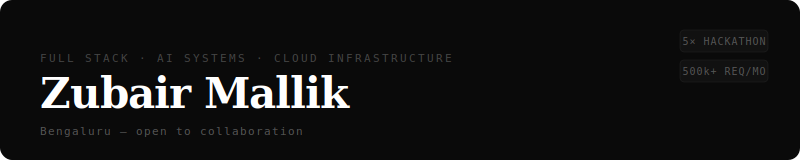

Building production-grade software with AI-powered systems — from UI to backend APIs to cloud infrastructure. I architect and ship full-stack systems across web, cloud, and AI layers, and enjoy pushing systems to their limits.

Worked and scaled startups from bootstrap phase to hundreds of thousands of requests per month and thousands of users.

---

### Technologies

---

